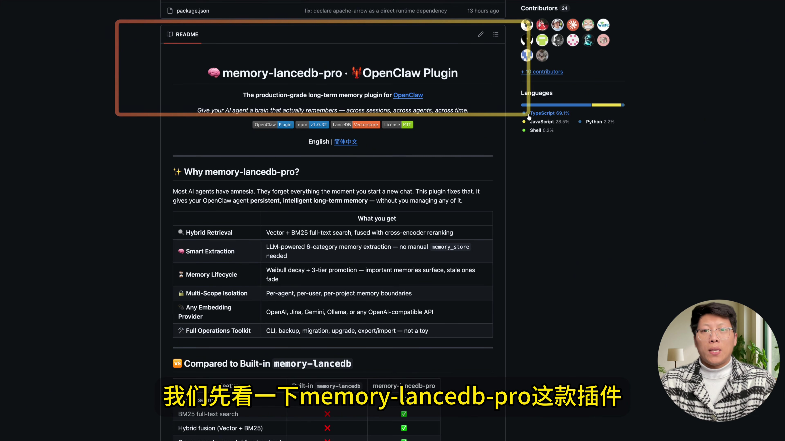
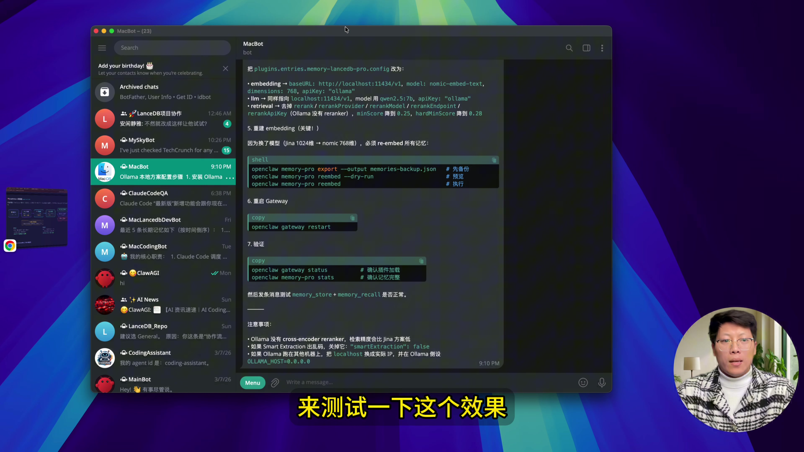
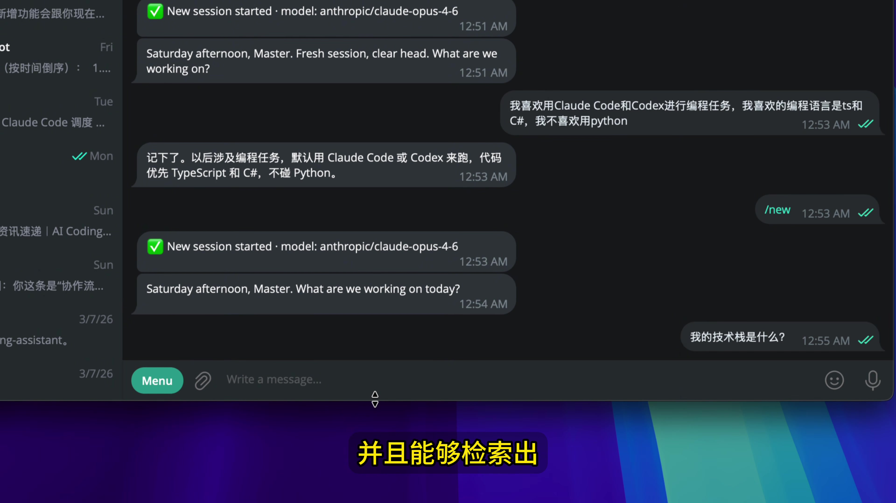
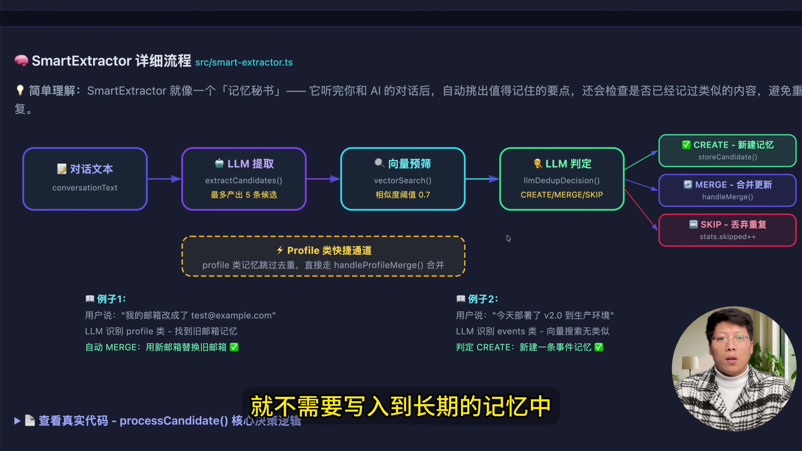
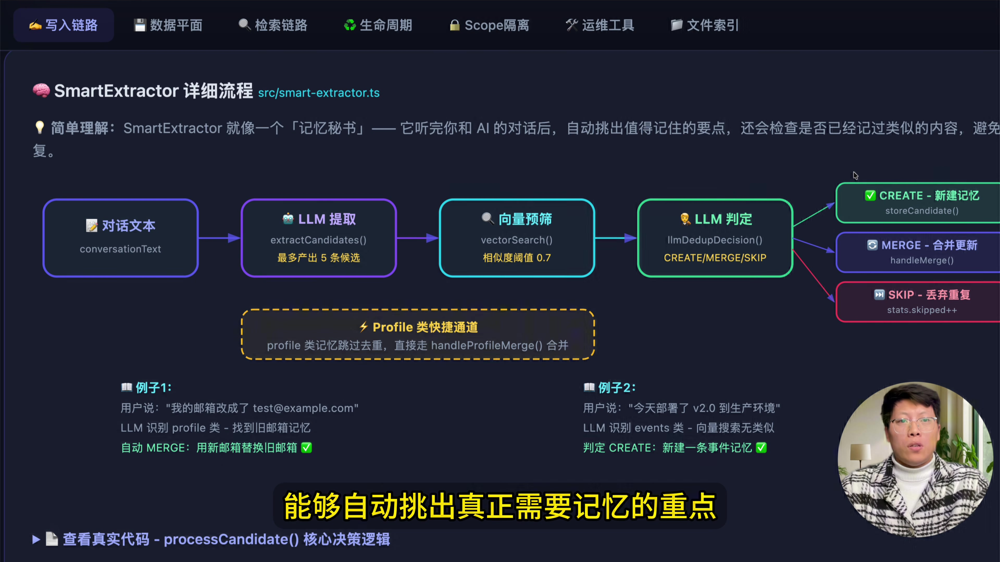
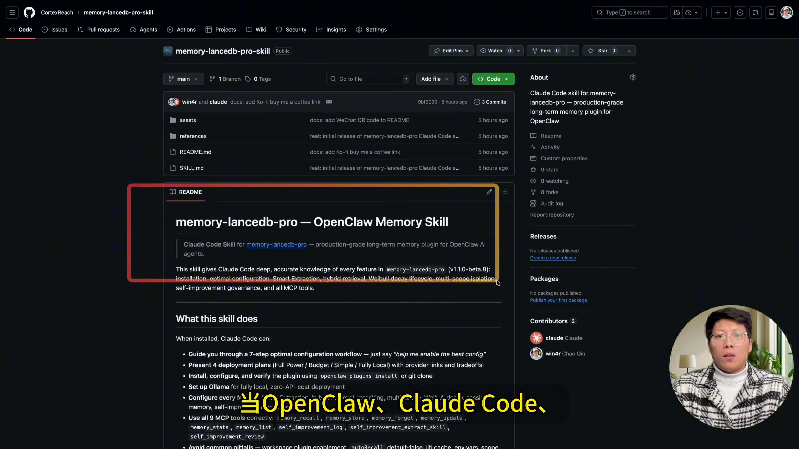
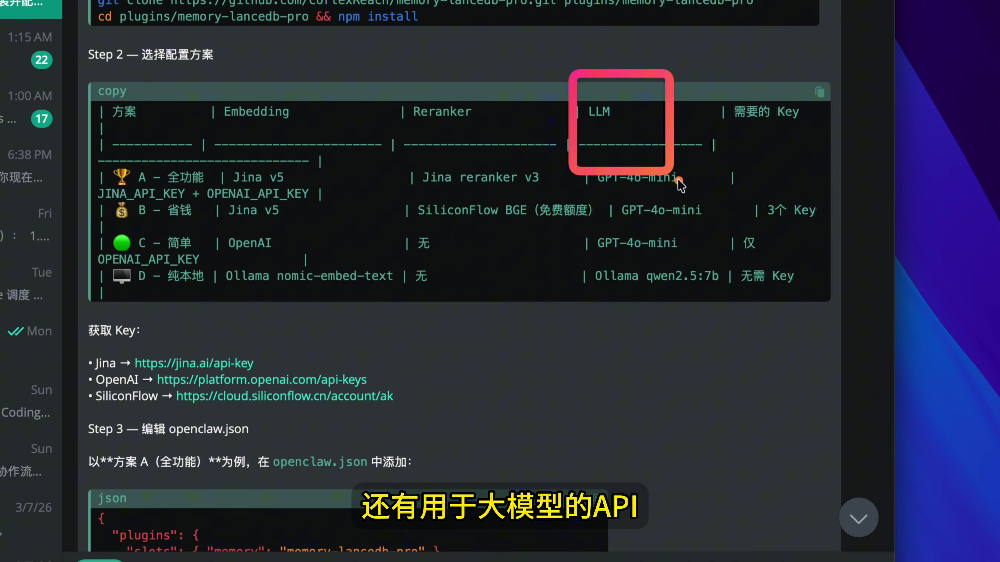
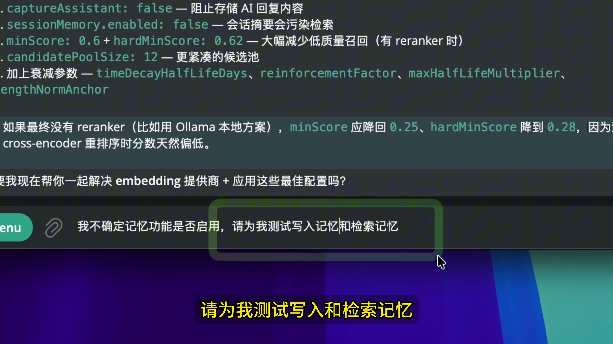

# 从视频实战到落地执行：OpenClaw 记忆增强 Skill 安装与启用教程

来源视频：https://youtu.be/bhuGrjuCM_g  
整理方式：语音转写 + 关键帧截图 + 操作复盘

> 说明：原视频无字幕，本文基于自动语音转写整理，术语已按 OpenClaw 场景做工程化修正。

## 一、你将得到什么

完成本教程后，你可以：

1. 理解“记忆增强 Skill”的核心机制（提取、去重、合并、检索）。
2. 在 OpenClaw 中按步骤安装并启用相关 Skill。
3. 用跨 Session 回归测试验证记忆是否真正生效。
4. 在 API 不可用时切换本地模型（Ollama 路线）继续运行。

## 二、关键截图（来自视频）










## 三、核心原理（视频内容提炼）

视频重点强调：

- 不把所有对话都写进长期记忆。
- 先做“价值判断”，再做“去重合并”。
- 只把长期有价值的信息写入长期层。
- 新会话通过检索层召回过往偏好与项目上下文。

一句话：把“对话日志”变成“可复用的结构化记忆”。

## 四、按教程步骤安装并启用 Skill（OpenClaw 可执行版）

### Step 1：检查当前 Skill 状态

```bash
openclaw skills check
```

预期：你能看到现有可用 Skill 与缺失依赖列表。

### Step 2：安装依赖（以 YouTube/视频链路为例）

```bash
python3 -m pip install --user yt-dlp faster-whisper
```

可选（若你要抽帧）：

```bash
ffmpeg -version
```

### Step 3：确认目标 Skill 已被 OpenClaw 识别

```bash
openclaw skills list | grep -E "youtube-watcher|video-frames|agent-memory"
```

### Step 4：启用方式说明

OpenClaw 本地 Skill 通常“安装即可用”（被扫描到就可调用）。
如果是从 ClawHub 安装新 Skill，可执行：

```bash
npx clawhub
```

然后按交互流程安装目标 Skill。

### Step 5：做一次最小验证（MVP）

- 向助手输入 3~5 条稳定偏好（技术栈/工具偏好/禁用项）。
- 新开会话询问“我偏好什么”。
- 观察是否能跨会话召回。

### Step 6：启用“质量门禁”

建议规则：

- 高价值信息才写长期记忆（偏好、决策、流程、约束）。
- 低价值噪声直接跳过（寒暄、天气类一次性信息）。
- 每周做一次召回准确率抽检。

## 五、故障排查（视频高频问题对照）

1. API 不可用/额度不足
   - 切换本地模型（Ollama）作为兜底。
2. 记忆写入成功但检索不到
   - 检查是否被去重合并策略过滤。
   - 做“写入 -> 新会话检索”回归。
3. 结果噪声多
   - 提高写入阈值，只保留长期价值信息。

## 六、你可以直接复用的执行清单

1. `openclaw skills check`
2. 安装依赖：`yt-dlp + faster-whisper`
3. 确认 Skill 可见：`skills list`
4. 输入偏好样本并写入
5. 新会话检索验证
6. 设置质量门禁与回归节奏

## 七、结论

这类记忆增强 Skill 的价值，不在“记得更多”，而在“记得对、取得到、可复用”。
把复杂配置转成自然语言驱动流程，才是对团队和个人最实用的落地方向。
